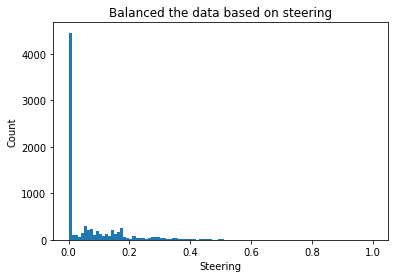

#**Behavioral Cloning** 

---
The goals / steps of this project are the following:
* Use the simulator to collect data of good driving behavior
* Build, a convolution neural network in Keras that predicts steering angles from images
* Train and validate the model with a training and validation set
* Test that the model successfully drives around track one without leaving the road
* Summarize the results with a written report


###Files Included in this project

My project includes the following files:  
* model.py containing the script to create and train the model  
* drive.py for driving the car in autonomous mode  
* model.h5 containing a trained convolution neural network  
* README.md(this file) summarizing the results  
* ScreenCapture.mp4 is the video of final model performance

#### Run the code yourself
Using the Udacity provided simulator and my drive.py file, the car can be driven autonomously around the track by executing  

```sh
python drive.py model.h5  
# If you want to capture the image, create a folder  
python drive.py model.h5 <dir>  
```

###Modeling Step(regression model)
1. Use AWS GPU. Upload data. I first used G2.2, later I opened a g2.8 one, which is super fast, also expensive. By default AWS set the volumn to be 16G, however I encouter out of space issue. I attached a 50G volumn with the same snapshot.  

2. Change csv file image directory
3. Data balancing  
Udacity provides 8k records, which is not too small. If I look into these 8000 images, then I can easily find the majority of images have very small steering angel. If I don't do anything just dump the data as it is, the model could simply predict every image steer 0 still get good result.  


With that being said, I applied a designated random sampling which ensured that the data is as balanced across steering angles as possible. This process included splitting steering angles into 100 bins and using at most 300 frames for each bin  


3. Use 3 cameras, and add a correction factor to left and right camera.  
For example, in the left image, it shows more space on left side than center image. Imagine if we train a model see only see pictures from center camera and predict the value of steering. Now all of a sudden it see one image from left camera, which has more space on left side. It will predict this image to trun lefter compare to the image taken at center camera at the same time. So we need to add a correction factor to adjust this effect.  

  
Basiclly I want to train a network when it sees a images from left camera, it will steer harder to the left. Could analyze the picture and use physics to calculate the angle. But for convinience, I will hard coded a factor of 0.25   
3. Load in the image
4. Convert image to np array, so that Keras can consume
5. Crop the image to exclude the car hood and sky, trees etc.. These information are irrelevant to decide how to drive, and add noise to confuse the model. 

6. Data augmentation: 
	- flip image, since the simulator generate a loop of image that mostly does left turn. The model has a much higher chance by steering to left even when it's better to stay in middle. By flipping the image, I generate equal change of steer to left and right.
7.  Preprocess data: normalize, resize, cropping


###Model Architecture and Training Strategy

####1. An appropriate model architecture has been employed

There are a few general concepts:  
* the car should stay in the center of the road as much as possible  
* if the car veers off to the side, it should recover back to center  
* driving counter-clockwise can help the model generalize  
* flipping the images is a quick way to augment the data  
* collecting data from the second track can also help generalize the model  
* we want to avoid overfitting or underfitting when training the model  
* knowing when to stop collecting more data


The model includes RELU layers to introduce nonlinearity, and the data is normalized in the model using a Keras lambda layer.

####2. Attempts to reduce overfitting in the model

The model contains 2 dropout layers in order to reduce overfitting. 

####3. Model parameter tuning

The model used an adam optimizer, so the learning rate was not tuned manually.

####4. Appropriate training/validation data

Initially I used train_test_split in `sklearn`, I splited from balanced dataset, 80% used for training, 20% for validation. Later I realized for validation, using the original full track's performance makes more sense:  
1. All the nice images from balance data set could be used in trainig model  
2. Using same validation data, without randomness, makes the model performance comparable not only within epoches, but also across mutliple models  

Technically, validation set image shouldn't be seen in the training, so people may have a different opinion regarding my approach. For me it works nicely, so I just keep it this way.  
####5. Use generator
Generator is a new concept I learnt from this project. When working on large dataset, like images. Sometimes simply loading images will exceed the size of memory. Generator allows to process a subset of data once a time, and keep track of last position.
For training set, the generator use preprocess funtion for training set. For validation set, generator use preprocess function for validation set


#### 6. Model Architecture
  
The model was trained using Adam optimiser and mean squared error as a loss function. I ran 20 epoches, each epoched I use 3838 images for training, total 8034 for validation. Note that the training set is random, so they are not the same images for every ephoch. The validation data is the same. Thus the validation loss is comparable between epochs and different models.  

Sometimes the model will overfit if I use too many epoches. Maybe in the middle, an epoch is the best. By looking at the validation loss, I can have a feel how the model improve/overfit over time.  

In order to retrive the training weights for each epoch, I add a call back list. To store the weights, I only curious to see the weights when validation loss is decrease. But Keras has the capability to store all the weights.  

At the end of the process, the vehicle is able to drive autonomously around the track without leaving the road.

Click [here]('ScreenCapture.mp4') to see the video